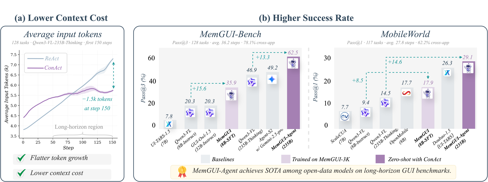
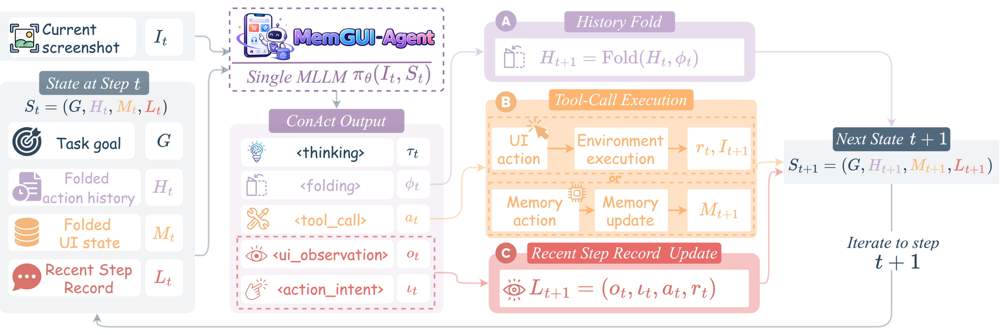
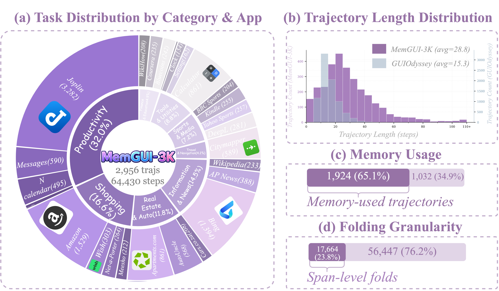

<div align="center">

<h1>
  <br>
  MemGUI-Agent: An End-to-End Long-Horizon Mobile GUI Agent with Proactive Context Management
</h1>


[](https://www.python.org/)
[](https://opensource.org/licenses/Apache-2.0)
[](https://huggingface.co/datasets/memgui-agent-anonymous/MemGUI-3K)
[](https://huggingface.co/memgui-agent-anonymous/MemGUI-8B-SFT)
[](https://memgui-agent-anonymous.github.io/)

<b>Anonymous-review implementation, training, and evaluation code for MemGUI-Agent.</b>

</div>

## Anonymous Review Artifacts

- Project page: [memgui-agent-anonymous.github.io](https://memgui-agent-anonymous.github.io/)
- Dataset: [MemGUI-3K](https://huggingface.co/datasets/memgui-agent-anonymous/MemGUI-3K)
- Model: [MemGUI-8B-SFT](https://huggingface.co/memgui-agent-anonymous/MemGUI-8B-SFT)
- Code: [anonymous GitHub repository](https://github.com/memgui-agent-anonymous/MemGUI-Agent)

## Main Results

<p align="center">
  
</p>

MemGUI-Agent improves both zero-shot 235B and trained 8B settings on
long-horizon mobile GUI benchmarks. On MemGUI-Bench, MemGUI-Agent-235B reaches
62.5% Pass@3, and MemGUI-8B-SFT reaches 23.4% Pass@1. On the
out-of-distribution MobileWorld GUI-Only benchmark, MemGUI-Agent-235B reaches
29.1% success rate, and MemGUI-8B-SFT reaches 17.9%.

MemGUI-Bench results and qualitative examples are available on the
[anonymous project page](https://memgui-agent-anonymous.github.io/#results).
MobileWorld GUI-Only is used solely as an out-of-distribution benchmark; this
anonymous mirror intentionally omits external leaderboard links.

For captioned leaderboard tables and paper figures, see the
[anonymous project page](https://memgui-agent-anonymous.github.io/#results).

## Overview

MemGUI-Agent is an end-to-end mobile GUI agent for long-horizon tasks that
require remembering progress, preserving UI facts, and controlling prompt
growth. Its core interface, **ConAct** (**Context-as-Action**), makes context
management part of each model response instead of an external module.

ConAct maintains three structured fields: **Folded Action History**, **Folded UI
State**, and **Recent Step Record**.

<p align="center">
  
</p>

MemGUI-Agent updates folded history, UI memory, and recent step records while
producing the next GUI action. We evaluate both a zero-shot 235B ConAct agent
with unchanged backbone weights and **MemGUI-8B-SFT**, an 8B agent trained on
**MemGUI-3K**.

## MemGUI-3K

MemGUI-3K contains 2,956 successful mobile GUI trajectories, 82,103 task steps,
and 64,430 evaluator-approved reasonable steps.

<p align="center">
  
</p>

Dataset usage: [data/memgui3k/README.md](data/memgui3k/README.md).

## Repository Layout

```text
MemGUI-Agent/
|-- data/
|   `-- memgui3k/                  # Dataset download, restore, packaging, and conversion tools
|-- evaluation/
|   `-- memgui3k_offline_eval/     # Step-level offline evaluation on MemGUI-3K
|-- scripts/                       # Convenience entrypoints
|-- training/
|   `-- ms_swift/                  # MemGUI-8B-SFT ms-swift LoRA SFT template
|-- website/                       # Project-page notes
|-- requirements.txt
`-- README.md
```

## Quick Start

Install the Python dependencies used by the public utilities:

```bash
pip install -r requirements.txt
```

Download MemGUI-3K from Hugging Face:

```bash
bash scripts/download_memgui3k.sh
```

Restore screenshots into `data/MemGUI-3K/images/`:

```bash
bash scripts/restore_memgui3k_images.sh
```

Build step-level multimodal training JSONL files:

```bash
bash scripts/build_memgui3k_training_data.sh
```

This writes:

```text
data/MemGUI-3K/training_data/
|-- train_sft.jsonl
`-- test_sft.jsonl
```

## Training MemGUI-8B-SFT

MemGUI-8B-SFT is trained with [ms-swift](https://github.com/modelscope/ms-swift)
from Qwen3-VL-8B-Instruct. The released template keeps the paper's key
hyperparameters:

| Parameter | Value |
|---|---|
| Base model | `Qwen/Qwen3-VL-8B-Instruct` |
| Training type | LoRA SFT |
| Epochs | 1 |
| Learning rate | `1e-4` |
| LoRA rank / alpha | `8 / 32` |
| Target modules | `all-linear` |
| Max length | `32768` |
| Per-device train batch size | `2` |
| Gradient accumulation | `8` |
| GPUs | 8 |

Run the public template:

```bash
bash training/ms_swift/train_memgui_8b_sft.sh
```

See [training/ms_swift/README.md](training/ms_swift/README.md) for the full
command and environment variables.

## Evaluation

The offline evaluation toolkit compares model outputs with MemGUI-3K gold step
responses and reports action matching, memory actions, folding quality, and
format compliance. See
[evaluation/memgui3k_offline_eval/README.md](evaluation/memgui3k_offline_eval/README.md).

For end-to-end rollout scripts, trajectories, and evaluation results, see:

- MemGUI-Bench: [anonymous project page](https://memgui-agent-anonymous.github.io/#results)
- MobileWorld GUI-Only: the evaluation protocol and results are documented in
  the anonymous submission and project page.

## Contact

For anonymous-review questions about the code or released artifacts, open an
issue in this repository.

## Citation

Citation metadata is withheld during anonymous review and will be restored
after the review period.

## License

Code in this repository is released under the Apache License 2.0.
